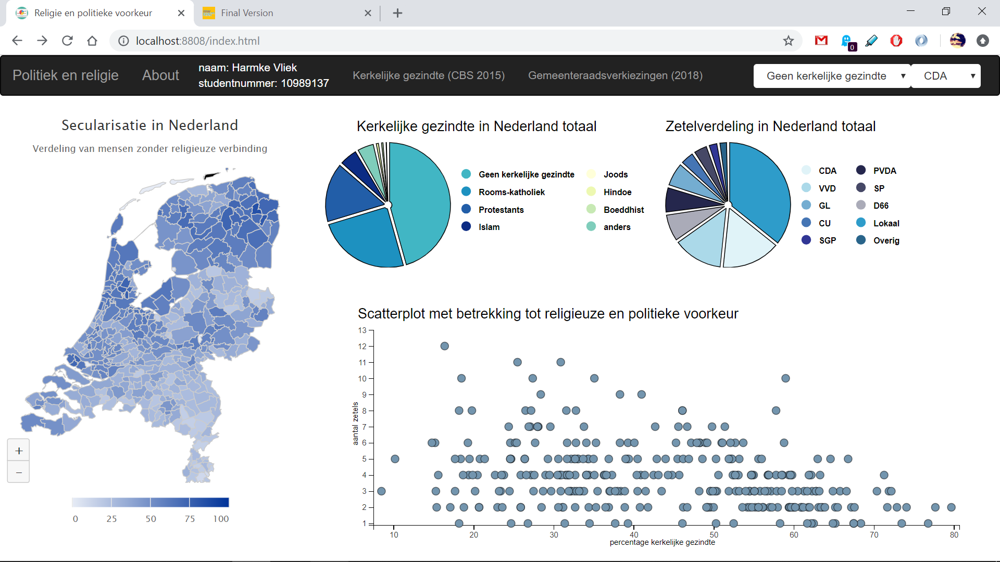
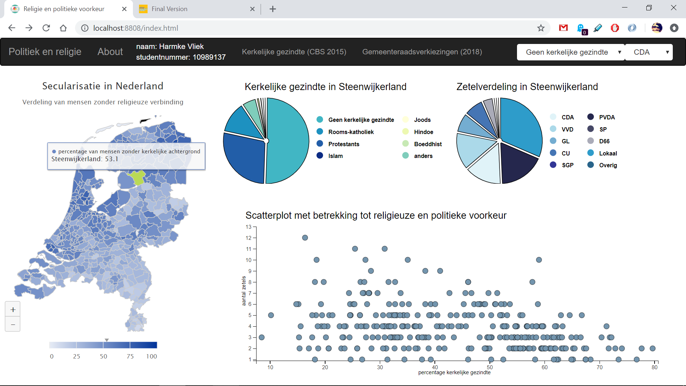
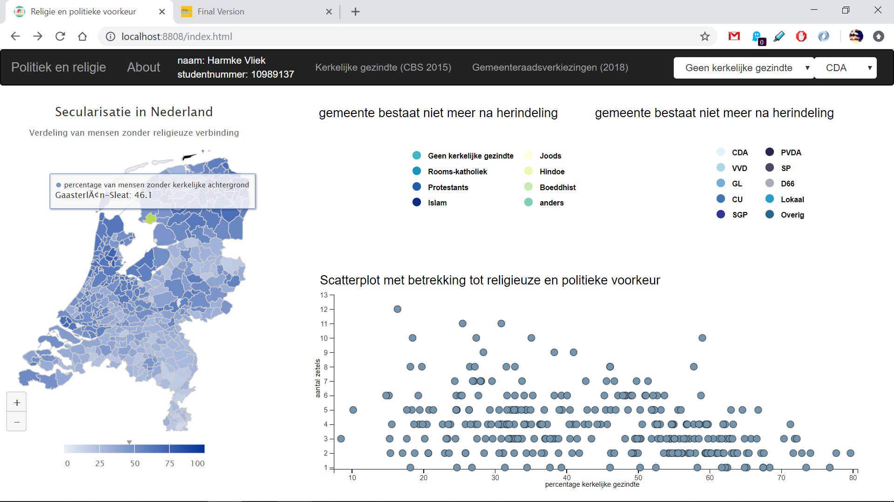
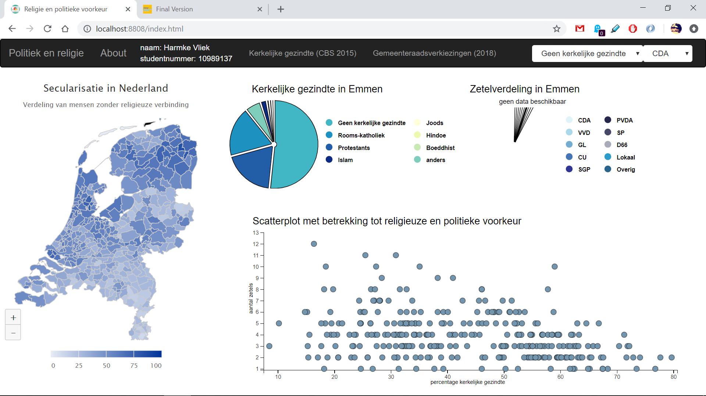
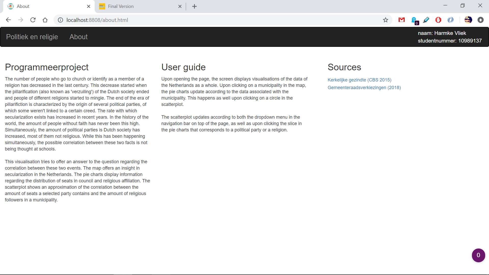

# Project
Final project of the minor Programmeren. Visualisations created by Harmke Vliek.

link to [Project](https://harmkev.github.io/finalProject/code/)

# Purpose
The number of people who go to church or identify as a member of a religion has decreased in the last century. This decrease started when the pillarification (also known as 'verzuiling') of the Dutch society ended and people of different religions started to mingle. The end of the era of pillarifiction is characterized by the origin of several political parties, of which some weren't linked to a certain creed. The rate with which secularization exists has increased in recent years. In the history of the world, the amount of people without faith has never been this high. Simultaneously, the amount of political parties is Dutch society has increased, most of them not religious. While this has been happening simultaneously, the possible correlation between these two facts is not being thought at schools.

This visualisation tries to offer an answer to the question regarding the correlation between these two events. The map offers an insight in secularization in the Netherlands. The pie charts display information regarding the distribution of seats in council and religious affiliation. The scatterplot shows an approximation of the correlation between the amount of seats a selected party contains and the amount of religious followers in a municipality.

# User guide
The page exists of four visualisations. These are a map, two pie charts and a scatterplot.

*Map*

The map renders a vision of the distribution of secularization in the Netherlands. Light blue indicates a low percentage of secularization, while dark blue refers to a high percentage of secularization. It provides an overview of clusters of either religious or atheist people and their positioning in the Netherlands.

*Pie charts*

The pie charts provide a resume of the amount of seats a party possesses in a municipal council and the distribution of religious affiliation in a municipality. Because of the fact that both visualisations are pie charts, comparing the seats per party to religious affliction is facile.

*Scatterplot*

The scatterplot offers an insight in the religious origin of a group voting for a certain party or vice versa. By indicating which municipalities are outliers, the municipality can be clicked upon and analysed using the two pie charts.

## Visualisation
Upon opening the page, the screen displays visualisations of the data of the Netherlands as a whole.

Upon clicking on a municipality in the map, the pie charts update according to the data associated with the municipality.

This happens as well upon clicking on a circle in the scatterplot. This circle will then turn orange, to indicate that it is selected. As the map has been created before the municipal reclassification, some municipalities do not have data or do not exist anymore. This in indicated trough the title of the plot and an empty pie chart.

The scatterplot updates according to both the dropdown menu in the navigation bar on top of the page, as well as upon clicking the slice in the pie charts that corresponds to a political party or a religion.
The links to the data sources are located in the navigation bar.

Up in the navigation bar, there is a button called About. This button opens a new html page describing the purpose of the project, the sources and the user guide.

# Description
The git contains a map called code, a map called doc and several markdown files. The markdown files are
* [DESIGN.md](DESIGN.md), which is a visualisation of the project;
* [PROCESS.md](PROCESS.md), which contains information concerning choices that were made during the process;
* [PROPOSAL.md](PROPOSAL.md), which contains a basic outline of the visualisation created at the start of the project;
* [REPORT.md](REPORT.md), which is a report summarizing the course of the project and the reasons behind design choices;
* [STYLE.md](STYLE.md), containing the style guide created by group I.

The map doc contains all images displayed in the several markdown files. The map code contains the JavaScript file [visual.js](code/visual.js), in which all code necessary for rendering the visualisations is set, as well as the [html page](code/index.html) necessary to display a webpage. The file [about](about.html) serves to display information about the page. Therewithal the favicon, [css file](code/style.css) and the [conversion file](code/CONVERT2JSON.py) is set in there. All data is stored in the map data.

# Sources of external code
* The svg of the Netherlands is obtained from [Highcharts](http://code.highcharts.com/mapdata/countries/no/no-all-all.js).
* The legend is made using the library D3 legend.
* The style of the page is enhanced by [bootstrap](https://maxcdn.bootstrapcdn.com/bootstrap/3.3.7/css/bootstrap.min.css).
* Both pie charts are created based on this [example](https://codepen.io/alexmorgan/pen/XXzpZP).
* The transition of the updatePieCharts is enhanced trough [arcTween](https://bl.ocks.org/mbostock/3916621).

# License
This project is licensed under a public release license - see the [LICENSE](LICENSE) file for details.

# Link to video
[video](https://youtu.be/Z5Nb3cq7Eic)

Due to my stutter, there are some breaks in between words; just keep listening, I'll continue talking.

© 2019 Harmke Vliek. No Rights Reserved.
