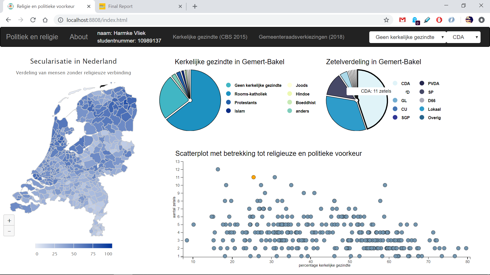
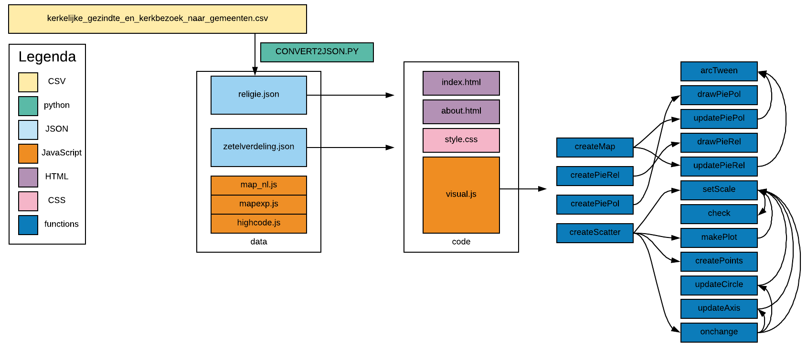

Harmke Vliek

10989137

Report: provide a resume concerning the development of the project.

# Description
This visualisation provides insight in the possible correlation between religious and political preference. The map shows an overview of secularization, meaning the percentage of people without any religious affiliation. The pie charts show the distribution of religious followers and seats in council for political parties. The scatterplot provides an opportunity to compare the amount of seats one political party contains to the percentage of religious belief, in which it is possible to see which municipalities are outliers and which municipalities are situated in the plot conform the trend.

# Technical design
The data funding these components are assembled in the json files [religie](/code/data/religie.json) and [zetelverdeling](/code/data/zetelverdeling.json). To create religie.json, CONVERT2JSON.py was created to convert the csv file to a json file.

The code exists of four components; the map, a pie chart regarding political preference, a pie chart regarding religious preference and a scatterplot displaying the possible correlation between political and religious preference. The map is first created in the function createMap. This function displays the map, fills the map with colours according to the data in religie.json and sets a legend. The function createPieRel contains all code necessary to render the pie chart with data belonging to 'Nederland totaal' and it's legend with help of the function drawPieRel. The same applies to the function createPiePol, which displays all political data for 'Nederland totaal' with help of the function drawPiePol. The functions are separated in two functions because it ensures updating the pie charts will go smoothly. The function createScatter contains all code necessary to create the scatterplot of one political party and one religious group. It invokes the functions makePlot and onchange, in which the functions createPoints, setScale, updateCircle and updateAxis are called. These functions set the axes of the plot according to the minimum and maximum values of the datasets referred to in the dropdown menu and set the points correctly in the plot. The default plot renders data regarding the political party CDA and the religion 'Geen kerkelijke gezindte' or no religious affiliation, which is actually not a religion. However, it is one of the religious movements identified in the pie charts.

The image below offers an insight in the structure of the code. As stated, the four main functions, coloured dark blue in the second column from the right, are the basis to create the visualisations that are exhibited upon entering the webpage.

These figures do not remain identical. Upon clicking on a municipality in the map, two functions are called. These functions are updatePiePol and updatePieRel. Both functions call the function arcTween, to ensure a proper transition of the pie charts during the update. The update functions make sure the pie charts are updated according to the data belonging to the municipality, requested from both json files. In case there is no data available, the pie chart will exist of just lines and the tooltip will display the message 'geen data beschikbaar'. In case the municipality does not exist, the pie chart will be hidden and the title will state 'gemeente bestaat niet meer na herindeling'.

The scatterplot updates according to the function onchange, in which the functions createPoints, setScale, check, updateCircle and updateAxis are called. These functions make sure both axes update according to the minimum and maximum values of both datasets and that the points are placed correctly. This function is either called upon the use of the dropdown menu, or upon a click in one of the pie charts. The dropdown menu indicates which party and religion are selected in the plot.

When the circles in the plot are clicked, the functions updatePiePol and updatePieRel are invoked, because of which the pie charts are changed according to the data belonging to the municipality that represents the point in the scatterplot. This point will then turn orange, to indicate the point in the plot from which is updated.

The way the several functions interact is indicated in the image shown above. The blue coloured column on the right contains several arrows pointing from one function to other functions. These are the interactions between functions.

# Challenges
The original idea concerning the map was an overview of the biggest political party in a municipality. I've changed this to percentage of secularization, as I felt it would be better for the visualisation as a whole, both because I did not feel religion was represented equal to the political aspect of this project and I thought it would provide a more interesting visualisation.

At first I wanted to put a checkbox in the map, to be able to show political parties/religions or not, however I did not attempt to create this as I decided I would create a map displaying secularization instead of political parties.

In the original design document, I did not propose a navigation bar. I did not think it was necessary, however by adding the about page and the dropdown menu for the scatterplot, it became necessary.

The original idea for the scatterplot was to put all parties and all religions in one plot. This is of course not possible. Hence I created a scatterplot containing a single party and religion instead of all of them in one. The plot can be updated using the dropdown menu in the navigation bar or upon clicking on a segment of the pie charts. The dropdown menu also serves as an indicator regarding the party and the religion displayed in the plot.

The original idea for the code existed of three functions to create the first visualisations and three update functions. This changed. As I implemented more functionality and on click functions, I noticed I had to split my functions in more functions to enable the update of the visualisations. Thus there are 16 functions instead of six.

# Decisions
The decision to fill the map with data regarding secularization instead of political parties was made because I originally wanted to implement a checkbox with different religions and not just secularization. If I had more time, I would have implemented that. The decision to WET code both pie charts and their legends was made because I think it is important to separate them, as their subject is very different. I would not change this, even if I had more time, because I think if I did not put it separately, it would look like they are of the same origin while they are distinctly different with respect to each other. I think the decisions to add a navigation bar and change the layout of the scatterplot were necessary, as both original ideas would not work due to complexity and even with more time I don't know whether I could come up with a fitting solution to display all parties and religions in one scatterplot, hence the dropdown menu in the navigation bar. The split of functions was necessary and I would not change it, as I would have to code more repetitive if I had kept to the original idea of six functions.
